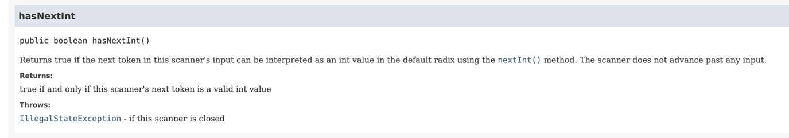
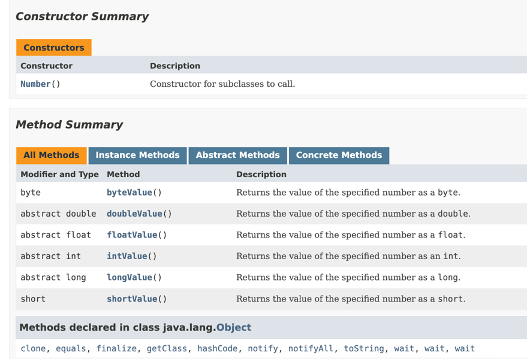

# [LEVEL 3] 카카오 테크 캠퍼스 BE 과제 1

## 요구사항
- [ ]  **현재 사칙연산 계산기는 (➕,➖,✖️,➗) 이렇게 총 4가지 연산 타입으로 구성되어 있습니다.**
    - [ ]  Enum 타입을 활용하여 연산자 타입에 대한 정보를 관리하고 이를 사칙연산 계산기 ArithmeticCalculator 클래스에 활용 해봅니다.

- [ ]  **실수, 즉 double 타입의 값을 전달 받아도 연산이 수행하도록 만들기**
    - [ ]  키워드 : `제네릭`
        - [ ]  단순히, 기존의 Int 타입을 double 타입으로 바꾸는 게 아닌 점에 주의하세요!
    - [ ]  지금까지는 ArithmeticCalculator, 즉 사칙연산 계산기는 양의 정수(0 포함)를 매개변수로 전달받아 연산을 수행
    - [ ]  피연산자를 여러 타입으로 받을 수 있도록 기능을 확장
        - [ ]  ArithmeticCalculator 클래스의 연산 메서드(`calculate`)
    - [ ]  위 요구사항을 만족할 수 있도록 ArithmeticCalculator 클래스를 수정합니다. (제네릭)
        - [ ]  추가적으로 수정이 필요한 다른 클래스나 메서드가 있다면 같이 수정 해주세요.

- [ ]  **저장된 연산 결과들 중 Scanner로 입력받은 값보다 큰 결과값 들을 출력**
    - [ ]  ArithmeticCalculator 클래스에 위 요구사항을 만족하는 조회 메서드를 구현합니다.
    - [ ]  단, 해당 메서드를 구현할 때 Lambda & Stream을 활용하여 구현합니다.

## 고민 내용

Level 3번을 해결하면서, 내가 하고 싶었던 것은

값을 가져오고, 이 값에 해당되는 Type 으로 ArithmeticCalculator Instance 를 만들고 싶었다.

하지만, 이게 현실적으로 불가능한 느낌이었다.

그리고 이 Level 3번을 수행하면서, 과연 Generics 은 왜 쓰이는거지? 라고 생각하게 되는 계기가 되었다.

결론부터 말하자면, Compile 할 시간에 Type 검사를 해서 예외를 방지시킨다.

Generics 는 Class 내부에서 사용할 Data Type 을 외부에서 정의해주는 Java 문법이었다.

처음부터 ArithmeticsCalculator 내부 클래스에서 해결하자고 하니, 계속해서 Logic 은 꼬이는 느낌이어서 실행하는 Main 함수의 힘을 빌리기로 결정하였다.

나는 Generics Class 를 만들려고 했다.

그치만, 이 방식에 소요되는 것을 보면 굉장히 이상했다.

우선 Class 를 하나하나 생성해야된다는 것에 비효율적임을 느꼈고,

Input 값을 직접 계산해야한다는 것이 굉장히 이상하다는 것을 느꼈다.

그래서 이처럼 값을 받았을 때, 변환이 가능한 값일 경우에 true 를 반환하는 함수들을 이용해서 Input 값을 작성하였다.

그리고, 값을 전달받았을 때, 자료형을 어떻게 결정하는가가 굉장히 스트레스였는데

값에 대해서 전부 받아들여올 수 있는 Number Wrapper 를 사용해,

double, int 에 대해서 값을 저장할 수 있도록 설정하였다.

Float 도 있는데, 왜 Double 인가?

이는 Float는 소수점 7자리에서 반올림을 하지만,

Double 은 보다 더 많은 소수점에서 반올림을 한다.

따라서 정확성을 위해서 Double 로 사용했다.

나머지는 Generics Method 를 이용해서 설정.